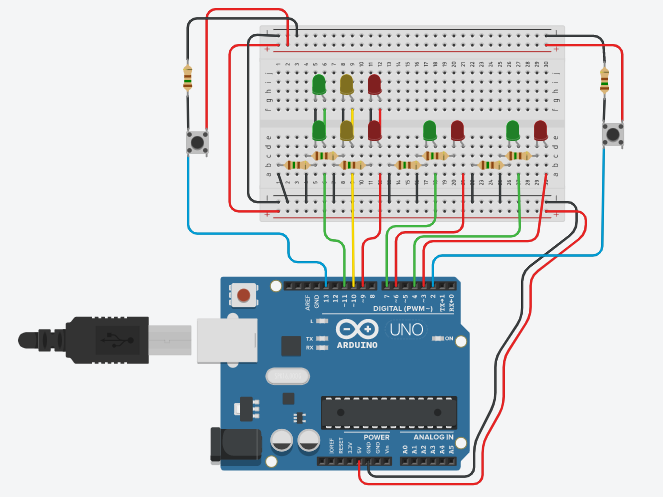

# Semáforo Inteligente

<h1 align="center">
    
</h1>

>Visualização do círcuito do semáforo inteligente na plataforma Tinkercad.

## O Projeto

O semáforo inteligente foi proposto na matéria "Sistemas Embarcados" na Etec, em uma atividade avaliativa, cujo foco era a criação de um semáforo (diferente dos modelos normais) que **somente** fosse acionado a sua alteração, de verde para vermelho, somente com a interação do pedestre (na existência de um pedestre). Assim, evitando que motoristas parem seus veículos quando não há a existência de nenhum pedestre para cruzar a rua.

## Funcionalidades

O CI foi criado com 2 semáforos principais com 3 estados (verde-amarelo-vermelho) para veículos e 2 semáforos secundários com 2 estados (verde-vermelho). 

Os semáforos principais sempre são matidos em seu estado verde, e somente é alterado após um pedestre acionar o botão do semáforo, dessa forma, seguindo para seus outros estados, amarelo-vermelho, e após um período de tempo retorna a verde. Para evitar que pedestres parem o trânsito após uma parada já feita segundos atrás, é implementado um timer para impedir que isso aconteça.

## Como usar

1. Crie o circuito que corresponda ao [CI da imagem mostrada](./semaforo_inteligente.png) em seu Arduino ou na plataforma [Tinkercad](https://www.tinkercad.com/);
2. Baixe o [código fonte](./semaforo_inteligente.ino) do projeto;
3. Caso feito o processo para um Arduíno, basta fazer o upload do arquivo baixado para seu arduino. Caso feito na plataforma Tinkercad, importe o código, ou cópie e cole-o onde na área correspondente a código.
4. Execute ;)
